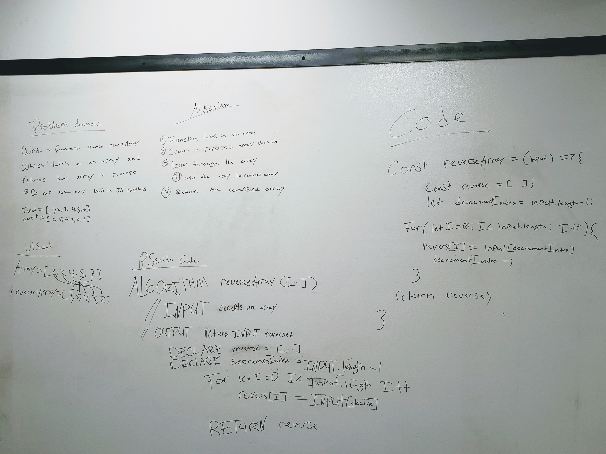

# Reverse an Array
Code challenge 01 for JS 401

## Challenge
Take in an array and return that array in reverse order without using any built in JS methods

## Approach & Efficiency
I decided to use a for loop to accomplish this task because I feel it is the most efficient way I currently know of solving the problem.

## Solution

