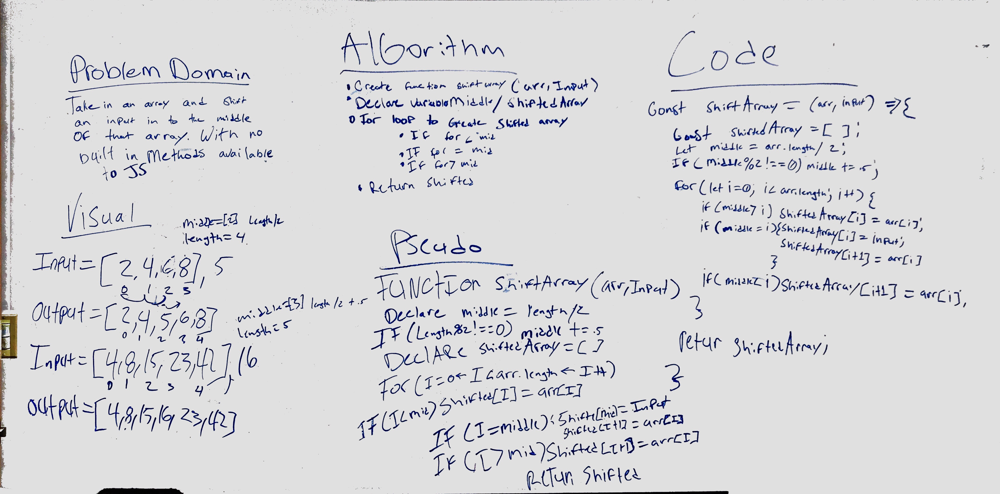

# Shift an array
Code challenge 01 for JS 401

## Challenge
Take in an array and an input. Return that array with the given input inserted in to the middle of the array.

## Approach & Efficiency
For this challenge I first figured out where the middle of the array would be. I determined that would either be an even number or a number ending in a float of .5. Then using that logic I designed a for loop to create a new array to be returned that would take in to account the extra index of the new array through conditional logic.

## Solution

