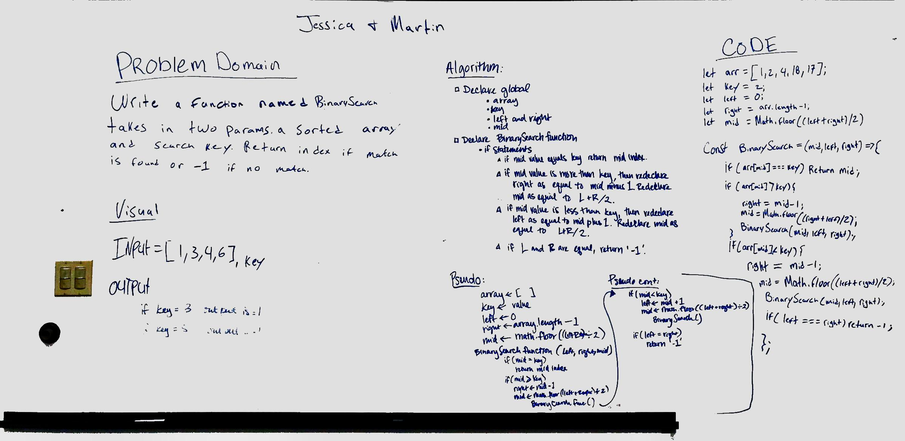

# Binary Search
Code challenge 03 for JS 401

## Challenge
Take in an array and a key. Search through the given array and return the index of the element if it is a match to key. If it isn't a match to key return -1;

## Approach & Efficiency
For this algorithim we felt it was best to use a recursive function to search through the array. O(log n)

## Solution

#### There is a mistake in this whitboard under the if arr at mid is less than key. It should say left = mid + 1
#### Had to change the code from the whiteboard in order to get it working
