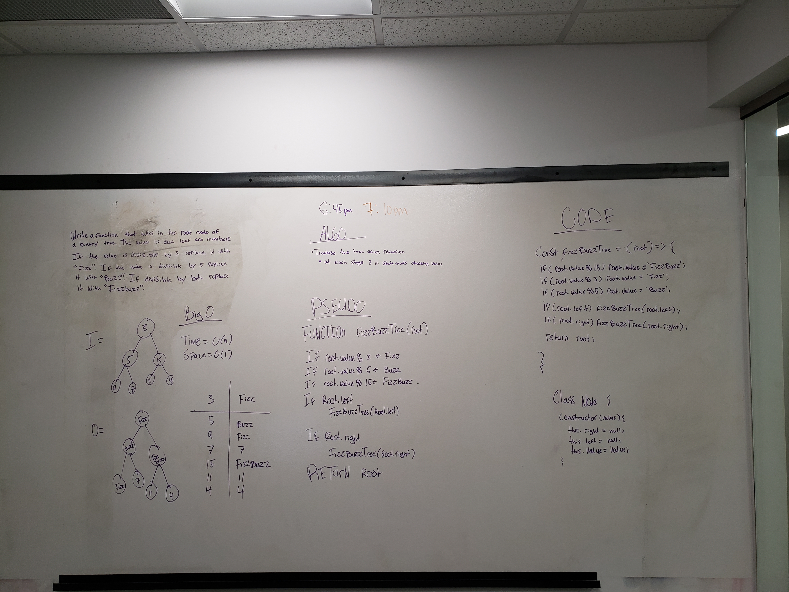

# FizzBuzz Tree

## Links

-   [PR](https://github.com/martinbalke-401-adavanced-js/data-structures-and-algorithms/pull/14)
-   [TRAVIS](https://www.travis-ci.com/martinbalke-401-adavanced-js/data-structures-and-algorithms)

## Whiteboard

## Challenge

Create a function called fizzBuzzTree that takes in the root node of a tree, traverses it, and modifies the values based on what they are divisible by.

## Approach & Efficiency

I decided to modify the tree in place and then return the root node. 
Big O is O(n) space is O(1) because I never create any variables
