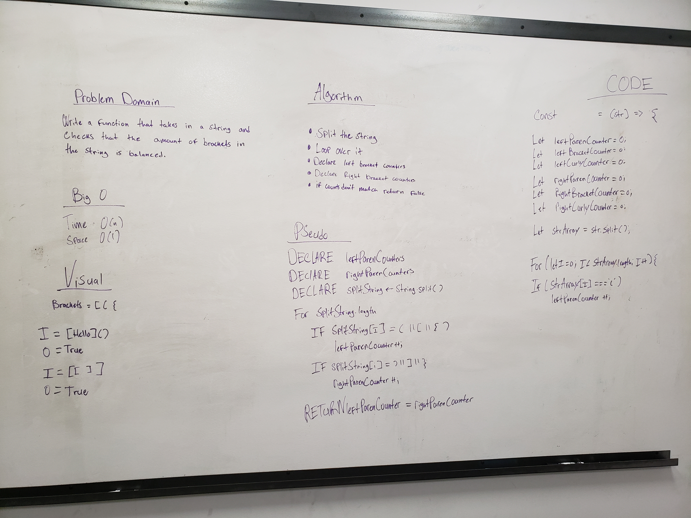

## Links

-   Link to Pull Request
-   Link to Travis

## Whiteboard

## Challenge

Create a function name multiBracketValidation that takes in a string and checks to see if all of the brackets have matching pairs. 

## Approach & Efficiency

I decided to split the string and loop over it
Time is 0(n) because I am looping over the array
Space is 0(n) because I make an array out of the data

Overall I think my approach is super inefficient but I couldn't think of another way
